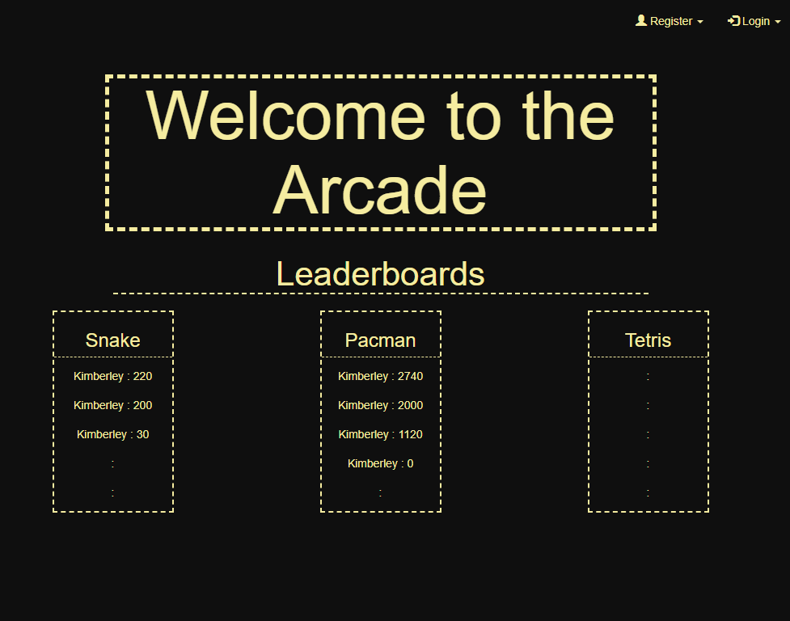
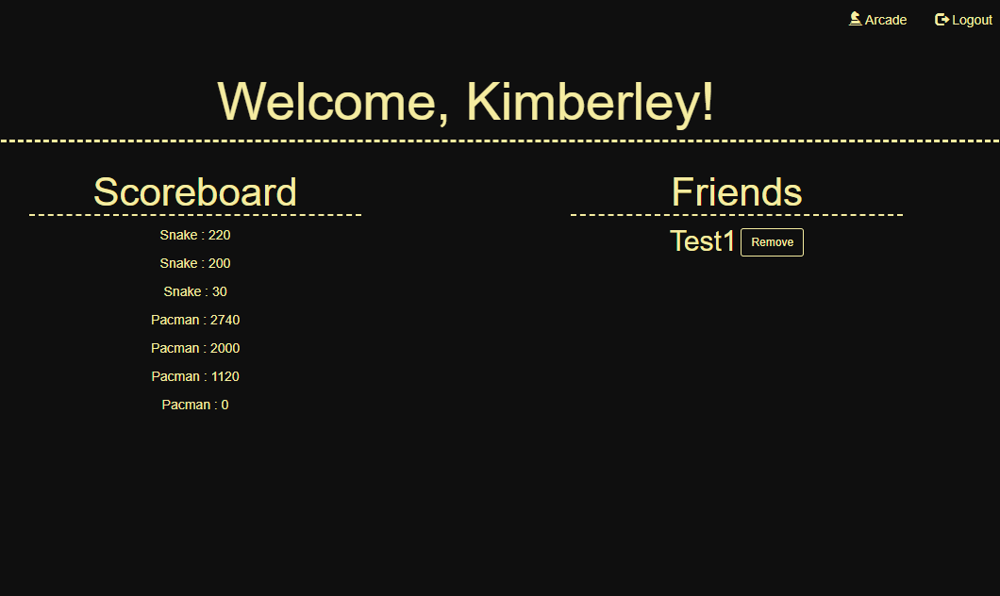
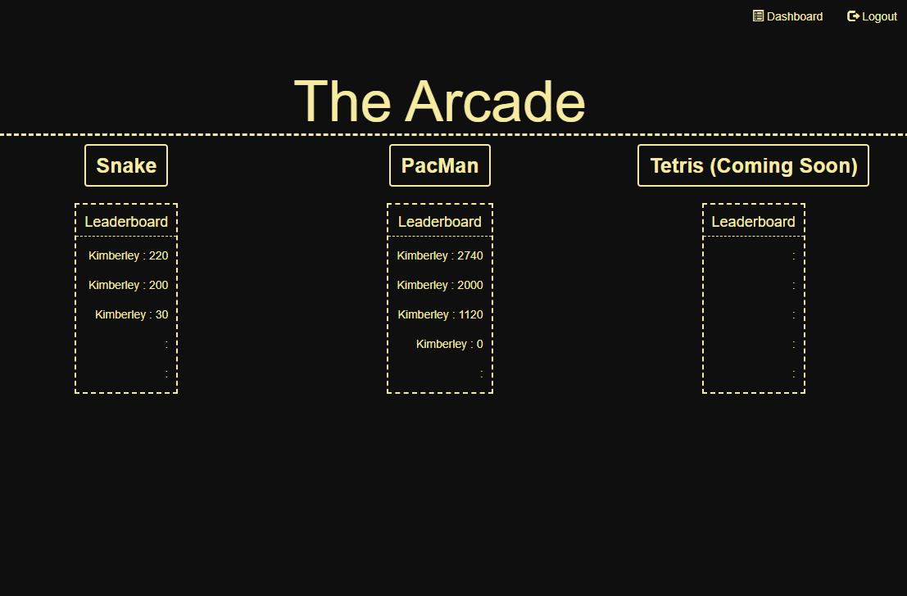
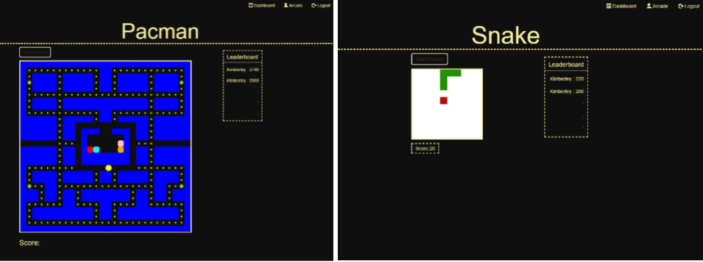
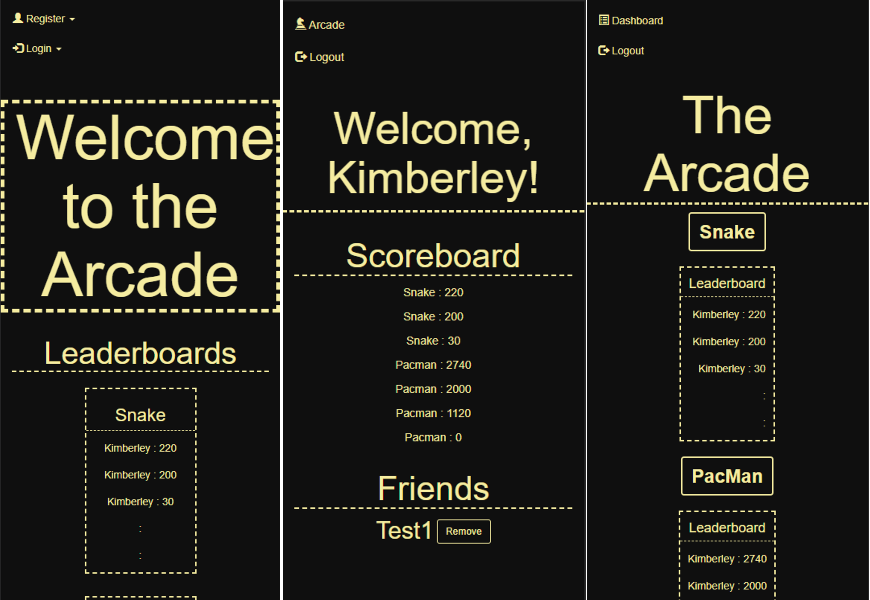

[](https://open.vscode.dev/KimGreenbush/WttA_Welcome-to-the-Arcade)

# Welcome to the Arcade(WttA)

Bringing it back retro-style. WttA is an 8-bit arcade-style game platform with classic games, like Snake and Pacman.

## Background

When I first started learning about JavaScript I wanted a fun way to do it. You learn best when it's fun after all. So I made some games.

Using Django's multi-application structure I was able to assemble and organize the games I had so far into one spot with the ability to add more easily.

There's also a registration system so players can save their scores and friend other players. Eventually I'd like to add a "friend area" for chatting and hanging out and more games.

It's also fully responsive using **Bootstrap** so you can play on any practically any screen size.

## Visuals

Checkout the [images](images) folder for more screenshots!







### Prerequisites

You will need [Python 3.9.1](https://www.python.org/downloads/release/python-391/), [Git](https://git-scm.com/book/en/v2/Getting-Started-Installing-Git), and a text editor to start.

## Installation

Using a terminal:

```shell
    // clone the repository
    `git clone https://github.com/KimGreenbush/WttA__Welcome-to-the-Arcade.git`

    // create and activate a virtual environment
    python -m venv <path/env>
    <path/env/Scripts/activate>

    // install dependencies
    pip install -r requirements.txt
```

## Running the tests

There are two test modules: one for login/registration validation and one for view navigation.

```shell
    // navigate to the folder with manage.py
    cd WttArcade

    // run the tests
    py manage.py test apps/Arcade/tests
```

## Contributing and Acknowledgments

Special acknowledgment to [Ania Kubow](https://github.com/kubowania) for the Javascript game tutorials.

## License

This project is licensed under the [GNU General Public License v3.0](license.md)
Free Software Foundation, Inc. - see the [license.md](license.md) file for
details